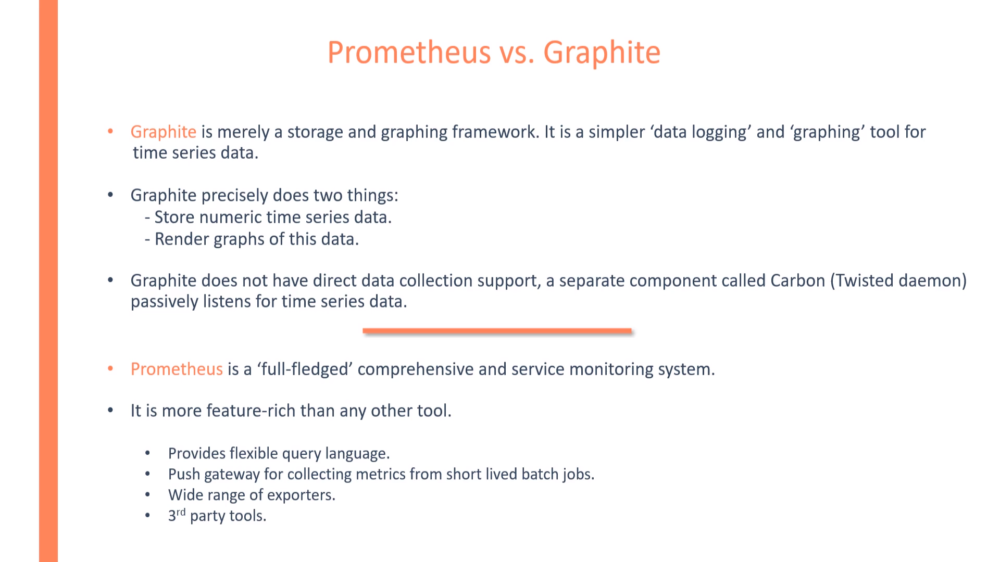
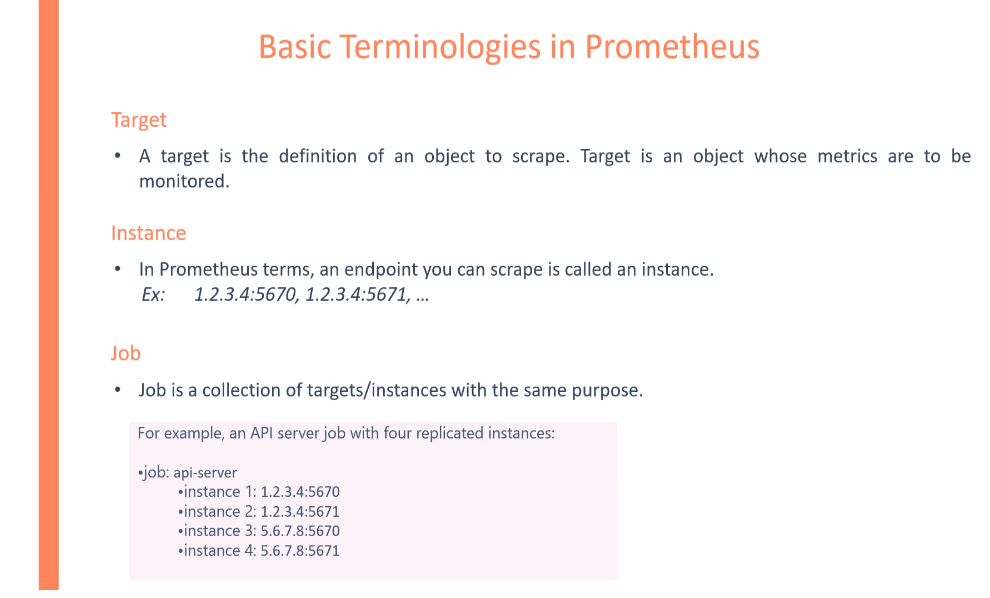
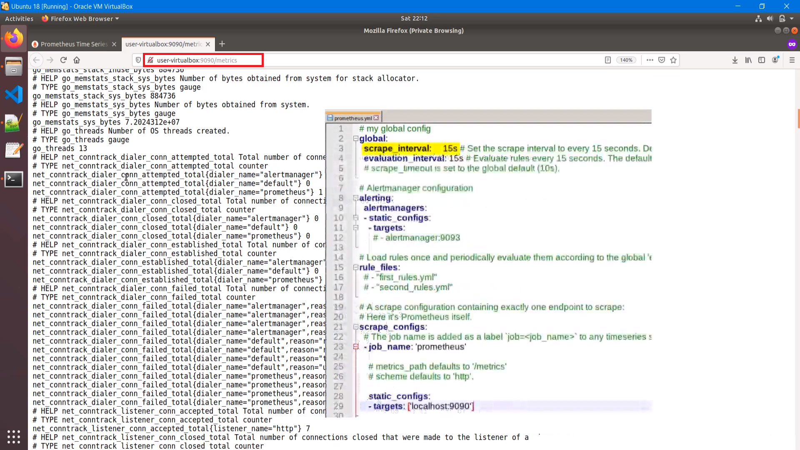
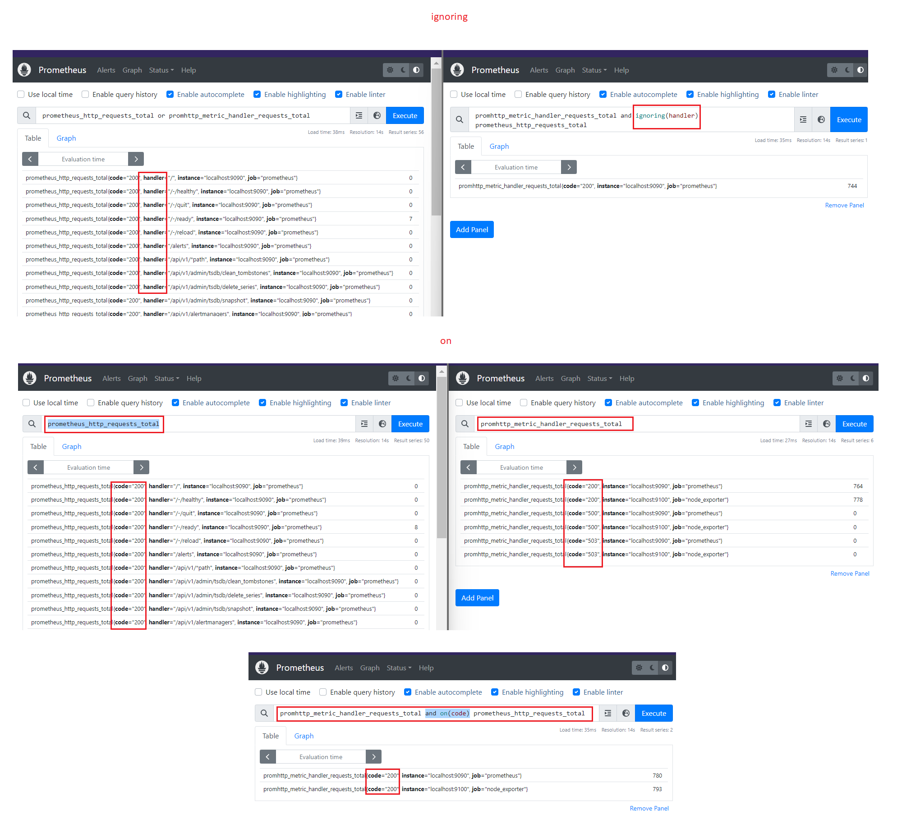
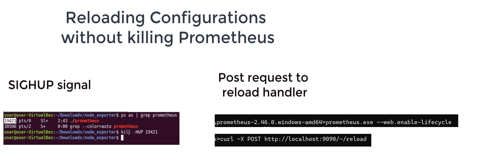
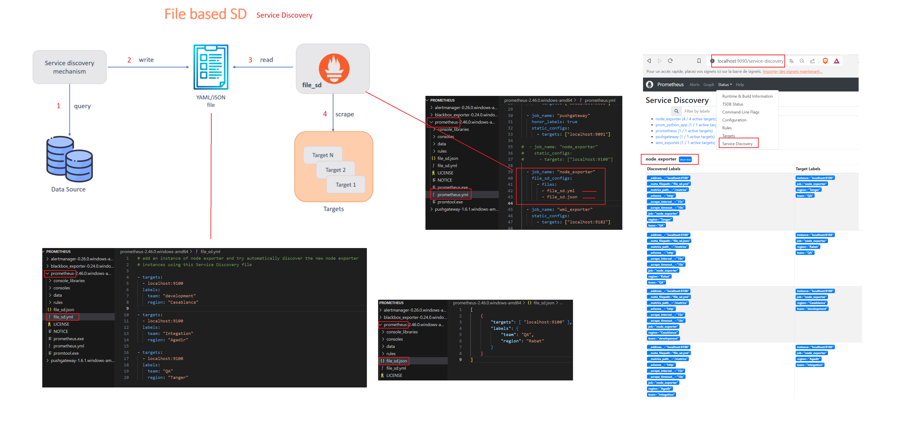

# Introduction

# Basic Terminologies

# Architecture

# First metric  UP

# Metric prometeus http_requests_total

# Metrics 

# Exporter

## node-exporter

## node-exporter-download

## node-exporter-config

## node-exporter-run

## node-exporter-config

## node-exporter-view-targets

## wmi-exporter-for-windowns

## wmi-exporter-for-windowns-target

## wmi-exporter-for-windowns-metric

# promql

## selectors-and-matchers

## operators

### operators-ignoring-on

### functions-change-deriv-predicat_linaie

### operators-functions-continus

### operators-rate-irate

# client-libraries-and-metric-types

## client-metric-types

## python-app-boilerplate

## metric-naming-convention

## metrics-adding-label-to-exposed-metrics

## metrics-adding-gauge-metrics-expositions

## metrics-summary-exposition

## metrics-histogram-exposition

## alification_of_instrumentation

## qualification_of_instrumentation-hom-mush-to-instrument

# recording-rules

# configuration-on-the-fly-auto-reload

# recording-rules-writing-recording

# alerting

## alerting-writing-and-firing-the-first-alert

## alerting-writing-and-firing-the-first-alert-labels

## alerting-alertmanager

## alerting-alertmanager-mail

### alerting-alertmanager-mail-template

### alerting-alertmanager-mail-template

## alerting-routing-tree-for-alerts

# http-api

# backbox-exporter

## backbox-exporter-install

# pushgatway

## pushgatway-push-metric

## pushgatway-pushing-metrics-with-cron

## pushgatway-pushing-metrics-with-python

# pushgatway-pitfalls

# service-discovery

