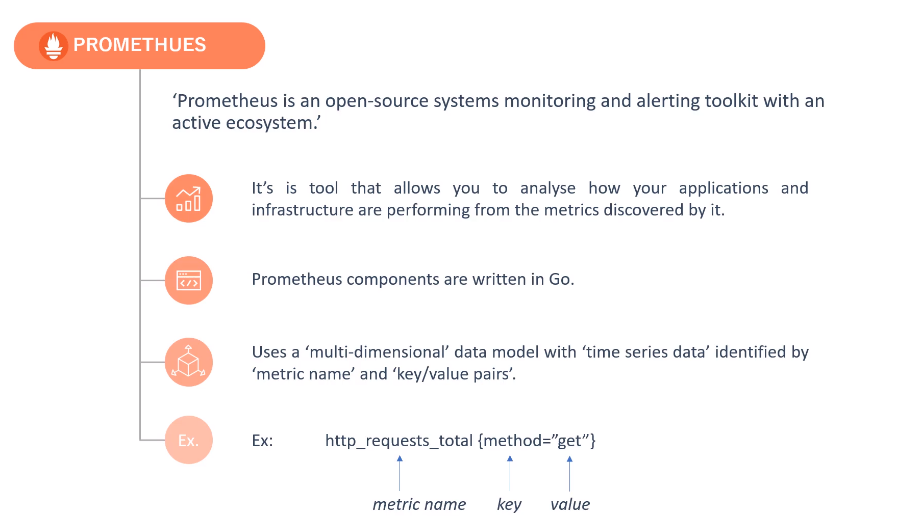

Download and Install 
https://prometheus.io/
https://prometheus.io/download/

in linux 

cd prometheus-2.46.0
run prometheus

````
./prometheus
````

in windows 
cd prometheus-2.46.0.windows-amd64
run prometheus
````
prometheus.exe
````

http://localhost:9090


Exporter

https://prometheus.io/docs/instrumenting/exporters/


WMI Exporter  for windonws system 
https://github.com/prometheus-community/windows_exporter
https://github.com/prometheus-community/windows_exporter/releases

function 
https://prometheus.io/docs/prometheus/latest/querying/functions/

clientlibs
https://prometheus.io/docs/instrumenting/clientlibs/

install prometheus client for python
https://github.com/prometheus/client_python

download dependency prometheus-client in python 
````
pip install prometheus_client
````


create python file /PROM_PYTHON_APPLICATION/country.py
````
import http.server
from prometheus_client import start_http_server

APP_PORT = 8000
METRICS_PORT = 8001

class HandleRequests(http.server.BaseHTTPRequestHandler):

    def do_GET(self):
        self.send_response(200)
        self.send_header("Content-type" , "text/html")
        self.end_headers()
        self.wfile.write(bytes("<html><head><title>First Application</title></head><body style='color: #333; margin-top: 30px;'><center><h2>Welcome to our first Prometheus-Pythos application.</h2></center> </body></html>" , "utf-8"))
        self.wfile.close()

if __name__ == "__main__":
    start_http_server(METRICS_PORT)
    server = http.server.HTTPServer(('localhost', APP_PORT), HandleRequests)
    server.serve_forever()    

# execute 
# python country.py
````

verify prometheus-client 

http://localhost:8001


start prometheus
````
./prometheus
./node_exporter
. windows_exporter-0.23.1-amd64.exe    WMI
````

add config in prometheus.yml 
````
scrape_configs:
  # The job name is added as a label `job=<job_name>` to any timeseries scraped from this config.
  - job_name: "prometheus"

    # metrics_path defaults to '/metrics'
    # scheme defaults to 'http'.

    static_configs:
      - targets: ["localhost:9090"]

  - job_name: "node_exporter"
    static_configs:
      - targets: ["localhost:9100"]

  - job_name: "wmi_exporter"
    static_configs:
      - targets: ["localhost:9182"]

  - job_name: "prom_python_app"
    static_configs:
      - targets: ["localhost:8001"]
````


check prometheus 
http://localhost:9090/targets?search=


curl localhost:8000?[1-5]


reload prometheus
=========================
>prometheus.exe --web.enable-lifecycle
>curl -X POST http://localhost:9090/-/reload

prom-tool
================
https://prometheus.io/docs/prometheus/latest/command-line/promtool/


reloard prometheus 
======================
$ curl -X POST http://localhost:9090/-/reload

or 

$ ps ax | grep alertmager
   2155 pts/0    S+     0:00 grep --color=auto alertmager
$ kill -HUP 2155


start app 
==============
$python summary.py

infini curl 
=============
$ while [ true ] ; do time curl localhost:8000 ; done


routing-tree-editor
======================
https://prometheus.io/webtools/alerting/routing-tree-editor/


install stress-ng 
====================
sudo apt-get install stress-ng


api 
============
https://prometheus.io/docs/prometheus/latest/querying/api/


start prometheus  auto reload
================
> prometheus.exe --web.enable-lifecycle

Reload 
===========
curl X POST http://localhost:9090/-/reload


blackbox probe 
=================
http://localhost:9115/probe?target=prometheus.io&module=http_ipv4&debug=true


push metric in the pushgateway
================================
echo "demo_metric 123" | curl --data-binary @- http://localhost:9091/metrics/job/demo_pg_job/instance/demo_instance/event/add


https://github.com/prometheus/client_python#exporting-to-a-pushgateway


customer_exporter
=====================
https://prometheus.io/docs/instrumenting/writing_exporters/

